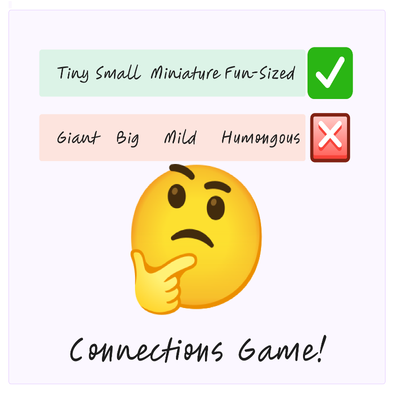

<!-- Improved compatibility of back to top link: See: https://github.com/othneildrew/Best-README-Template/pull/73 -->

<a name="readme-top"></a>
<br />

<div align="center">
  <a href="https://github.com/othneildrew/Best-README-Template">
	
  </a>

  <h3 align="center">Connections Game Materia Widget</h3>

  <p align="center">
	A recreation of the New York times Connectins game in materia for teachers to create and students to play
	<br />
	<a href="https://www.nytimes.com/games/connections"><strong>The New York Times Connections Game »</strong></a>
	<br />
	<br />
	<a href="https://connections.swellgarfo.com/">An example of a successful recreation of connections</a>
	·
  </p>
</div>

<div>
	<ol>
		<li> ✅Make the creator ui more intuitive</li>
		<li> ✅Make the player ui more intuitive?</li>
		<li> ✅Give the creator a dropdown option to choose a grid size of 2x2, 3x3,4x4, and 5x5</li>
		<li> ✅Refactor code and logic so that it works with different grid sizes</li>
		<li> ✅Clean up code in score_module.php so it works with variable grid sizes and remove unused code</li>
		<li> ✅Make the game name equal the name of the creator input.</li>
		<li>feel free to suggest improvements editing this file or by submitting an issue</li>
	</ol>
</div>

<!-- TABLE OF CONTENTS -->
<details>
  <summary>Table of Contents</summary>
  <ol>
	<li>
	  <a href="#about-the-project">About The Project</a>
	  <ul>
		<li><a href="#built-with">Built With yarn, webpack, scss, and vanilla JS and html</a></li>
	  </ul>
	</li>
	<li>
	  <a href="#getting-started">Getting Started</a>
	  <ul>
		<li><a href="#installation">Installation</a></li>
	  </ul>
	</li>
	<li>
		<a href="https://ucfopen.github.io/Materia-Docs/develop/widget-developer-guide.html"> Materia Widget Development Docs </a>
		</li>
  </ol>
</details>

<!-- ABOUT THE PROJECT -->

## Connections Game Materia Widget

[![NYT Connections ][NYT Connections]](https://static1.makeuseofimages.com/wordpress/wp-content/uploads/2024/03/nyt-connections-second-group-done.png)

Materia is an appstore that hosts many different widgets. The aim of the widgets is to have games that teachers can grade

follow the <a href="#installation"> instructions to get started.
<a href="https://ucfopen.github.io/Materia-Docs/develop/widget-developer-guide.html"> Materia Widget Development Docs </a>

<p align="right">(<a href="#readme-top">back to top</a>)</p>

### Built With

Built With yarn, webpack, scss, and vanilla JS and html

<p align="right">(<a href="#readme-top">back to top</a>)</p>

<!-- GETTING STARTED -->

## Getting Started

To get started, clone the repo and type yarn or yarn install in the terminal

### Prerequisites

Yarn is preffered for this project since it is faster than npm at building materia
To install you can use homebrew

-   yarn
    ```sh
    brew install yarn
    ```

### Installation

1. Clone the repo
    ```sh
    git clone https://github.com/your_username_/Project-Name.git
    ```
2. Install packages with yarn
    ```sh
    yarn install
    ```
3. Start the local development server with start script
    ```sh
    yarn start
    ```

<p align="right">(<a href="#readme-top">back to top</a>)</p>
